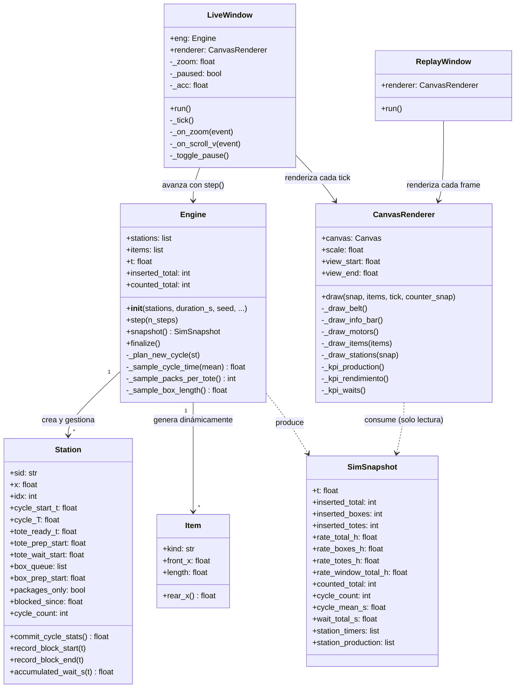

# 🏭 SimTimeInd v3

> **Simulador 2D de cinta de inducción con interfaz visual en tiempo real**
> Desarrollado para análisis de rendimiento operativo en instalaciones de intralogística.


---

## 📋 Tabla de contenidos

1. [Descripción](#descripción)
2. [Tecnologías](#tecnologías)
3. [Arquitectura y diseño OOP](#arquitectura-y-diseño-oop)
4. [Diagrama UML](#diagrama-uml)
5. [Modelo de simulación](#modelo-de-simulación)
6. [Interfaz visual](#interfaz-visual)
7. [Instalación y uso](#instalación-y-uso)
8. [Opciones CLI](#opciones-cli)
9. [Compilar como ejecutable](#compilar-como-ejecutable)
10. [Estructura del proyecto](#estructura-del-proyecto)

---

## 📦 Descripción

SimTimeInd simula el comportamiento de una **cinta de inducción de paquetería** con hasta 22 mesas de operarios. Modela:

- 🔄 El **ciclo de trabajo** de cada operario: preparación de cubetas vacías y paquetes, inducción en cinta y tiempos de espera por falta de hueco.
- 📦 El **flujo de ítems** por la cinta a 22 m/min con gap configurable y modo de empuje.
- 📊 Las **métricas de producción** en tiempo real: bultos/hora, cubetas/hora, paquetes/hora, ESPERAS.
- ⚖️ Comparación **teórico vs práctico** del rendimiento por zona y mesa.

El simulador permite ejecutar en modo **live** (con UI), en modo **batch** (sin UI, máxima velocidad) y **reproducir grabaciones** `.sim.gz`.

---

## 🛠️ Tecnologías

| Tecnología | Uso |
|------------|-----|
| 🐍 **Python 3.10+** | Lenguaje principal |
| 🖼️ **Tkinter** (stdlib) | UI gráfica — Canvas 2D, scrollbars, zoom |
| 🎲 **random** (stdlib) | Generación estocástica de ciclos y longitudes |
| 💾 **gzip + json** (stdlib) | Serialización de grabaciones `.sim.gz` |
| ⌨️ **argparse** (stdlib) | Interfaz de línea de comandos |
| 🧩 **dataclasses** (stdlib) | Modelos de datos tipados e inmutables |
| 📦 **PyInstaller** | Compilación a `.exe` standalone para Windows |

> ✅ Sin dependencias externas de terceros. Solo librería estándar de Python.

---

## 🏗️ Arquitectura y diseño OOP

El proyecto aplica los principios **SOLID** con separación estricta en tres capas:

```
main.py (CLI / orquestación)
    │
    ├── core/          ← Dominio puro, sin UI ni I/O
    │   ├── constants.py   fuente única de verdad (constantes físicas)
    │   ├── models.py      dataclasses: Item, Station, SimSnapshot
    │   ├── belt.py        geometría de la cinta y búsqueda de huecos
    │   ├── engine.py      motor de simulación paso a paso
    │   └── recorder.py    serialización/deserialización .sim.gz
    │
    ├── ui/            ← Presentación, sin lógica de negocio
    │   ├── canvas_renderer.py   renderizado 2D completo cada tick
    │   ├── live_window.py       ventana live con zoom y scrollbars
    │   └── replay_window.py     reproducción de grabaciones
    │
    └── utils/
        └── formatting.py    helpers de formato y color
```

### ✅ Principios SOLID aplicados

| Principio | Aplicación concreta |
|-----------|---------------------|
| **S** – Single Responsibility | `engine.py` solo simula · `recorder.py` solo graba · `canvas_renderer.py` solo dibuja · `belt.py` solo calcula huecos |
| **O** – Open/Closed | Nuevos paneles KPI en `CanvasRenderer` sin modificar `Engine` |
| **L** – Liskov | `_FakeStation` en replay es sustituible por `Station` en el renderer |
| **I** – Interface Segregation | `Engine` solo expone `snapshot()` hacia la UI; la UI nunca accede al estado interno |
| **D** – Dependency Inversion | La UI depende de `SimSnapshot` (DTO puro), no de `Engine` directamente |

### 🔁 Flujo de datos (Observer implícito)

```
Engine ──snapshot()──► SimSnapshot ──draw()──► CanvasRenderer
 (Modelo)               (DTO puro)              (Vista)
```

---

## 📐 Diagrama UML



---

## 🎮 Modelo de simulación

### 🏭 Zonas de producción

| Zona | Mesas | Ciclo medio | Descripción |
|------|-------|-------------|-------------|
| Zona 1 | M01–M07 | 63 s (configurable) | 7 mesas normales |
| Zona 2 | M08–M14 | 63 s (configurable) | 7 mesas normales |
| Zona 3 | M15–M21 | 63 s (configurable) | 7 mesas normales |
| M22 | solo paquetes | 22.5 s (160 paq/h) | sin cubeta vacía |

### ⏱️ Ciclo operario (M01–M21)

Cada ciclo de duración `T` sigue esta secuencia temporal:

| Fracción del ciclo | Evento |
|--------------------|--------|
| 0% | Inicio del ciclo — operario comienza a preparar la cubeta |
| 8–13% | Cubeta lista → se intenta inducir en la cinta |
| 45–67–90% | Paquetes listos secuencialmente (1, 2 o 3 según probabilidades) |
| 100% | Nuevo ciclo si: cubeta inductada + paquetes inductados + tiempo cumplido |

**Distribución de paquetes por ciclo:**

| k paquetes | Probabilidad |
|------------|--------------|
| 1 paquete | 88.3% |
| 2 paquetes | 11.7% |
| 3 paquetes | 0.0% |

### ⏳ Lógica de ESPERAS

El tiempo de bloqueo **solo se acumula** cuando se cumplen simultáneamente:

1. El operario ha terminado de preparar todos los ítems del ciclo (`t ≥ 90% del ciclo`).
2. Tiene al menos 1 ítem pendiente de inducir (sin hueco disponible en la cinta).

> El operario está **ocioso** — no puede coger la siguiente cubeta hasta inducir el último ítem.

### 📍 Punto de conteo

Los ítems se cuentan al cruzar `x = 50.0 m` (~5 m después de M22). Este contador genera las métricas de producción real mostradas en el panel.

### 🎨 Colores semánticos

| Elemento | Color | Hex |
|----------|-------|-----|
| Paquetes (boxes) | Azul | `#3B9EF5` |
| Cubetas vacías (totes) | Naranja | `#F5A623` |
| Totales / producción | Verde | `#4CAF82` |
| Tiempos de ciclo | Blanco | `#E8ECF2` |
| Bloqueo activo | Rojo | `#E84040` |
| Motores de cinta | Teal | `#00C8A7` |

---

## 🖥️ Interfaz visual

La ventana principal es **redimensionable** como cualquier carpeta del escritorio.

### 📐 Zonas de la ventana

**Barra superior** — parámetros de la instalación (velocidad, dimensiones, gap, buffer).

**Zona de cinta** — representación 2D de la cinta con:
- Ítems deslizándose (paquetes azules, cubetas naranjas).
- Líneas de mesa con indicador de estado (gris = normal, rojo = bloqueada).
- Posiciones de motores marcadas con línea teal.
- Badges verticales bajo cada mesa con tiempos de preparación en curso.

**Panel KPI inferior** — 3 columnas:

| Columna | Contenido |
|---------|-----------|
| **PRODUCCIÓN** | Barras de progreso total/paquetes/cubetas vs target; contador real; tasa últimos 60 s |
| **RENDIMIENTO OPERARIO** | Tabla TEÓRICO vs PRÁCTICO por fila: M01-M21/mesa · Σ M01-M21 · M22 · TOTAL |
| **ESPERAS** | Tiempo total acumulado, media por mesa, peor mesa, desglose por estación |

**Barra de control** — Play/Pausa y control de velocidad (0.1×–50×).

### 🔍 Zoom y navegación

| Acción | Resultado |
|--------|-----------|
| Redimensionar ventana | Canvas scrollable; la simulación no se redimensiona |
| `Ctrl + Rueda ↑` | Zoom in (hasta 4×) |
| `Ctrl + Rueda ↓` | Zoom out (hasta 0.3×) |
| `Rueda ↑/↓` | Scroll vertical |
| Barras de scroll | Navegación horizontal y vertical |

---

## 🚀 Instalación y uso

```bash
# Simulación en vivo (configuración por defecto)
python main.py

# Con parámetros personalizados
python main.py --stations 22 --duration 3600 --speed 2.0 --push

# Modo batch — sin UI, máxima velocidad, guarda grabación
python main.py --stations 22 --duration 3600 --no_ui --push --record out.sim.gz

# Reproducir grabación
python main.py --replay out.sim.gz
python main.py --replay          # abre selector de archivo
```

---

## ⚙️ Opciones CLI

| Argumento | Default | Descripción |
|-----------|---------|-------------|
| `--stations` | `22` | Número de mesas (1–22) |
| `--duration` | `3600` | Duración simulada en segundos |
| `--seed` | `42` | Semilla aleatoria (resultados reproducibles) |
| `--speed` | `1.0` | Multiplicador de velocidad de visualización |
| `--view` | `full` | `full` = toda la cinta · `tail` = últimas mesas |
| `--push` / `--no_push` | `push` | Modo de empuje (gap 0 mm / 50 mm) |
| `--cycle_mean` | `63.0` | Ciclo medio operario en segundos (zonas 1-3) |
| `--cycle_sd` | `0.0` | Desviación estándar del ciclo en segundos |
| `--cycle_min` | `30.0` | Ciclo mínimo absoluto en segundos |
| `--cycle_max` | `120.0` | Ciclo máximo absoluto en segundos |
| `--p2` | `0.117` | Probabilidad de 2 paquetes por ciclo |
| `--p3` | `0.0` | Probabilidad de 3 paquetes por ciclo |
| `--box_sd_mm` | `30.0` | Desviación estándar longitud de paquete en mm |
| `--target_total_h` | `2700` | Target total bultos/hora |
| `--target_boxes_h` | `1500` | Target paquetes/hora |
| `--target_totes_h` | `1200` | Target cubetas vacías/hora |
| `--record` | — | Ruta de salida `.sim.gz` |
| `--no_ui` | — | Modo batch sin ventana gráfica |
| `--replay` | — | Ruta de grabación a reproducir |

---

## 📦 Compilar como ejecutable

```bash
pip install pyinstaller
build.bat
```

Genera `dist/SimTimeInd.exe` — ejecutable standalone sin Python instalado.

---

## 📁 Estructura del proyecto

```
SimTimeInd_v3/
├── main.py                         Punto de entrada y CLI
├── build.bat                       Script de compilación PyInstaller
├── README.md
└── simtimeind/
    ├── core/
    │   ├── constants.py            Constantes físicas y defaults
    │   ├── models.py               Dataclasses: Item, Station, SimSnapshot
    │   ├── belt.py                 Geometría y búsqueda de huecos en cinta
    │   ├── engine.py               Motor de simulación
    │   └── recorder.py             Serialización .sim.gz
    ├── ui/
    │   ├── canvas_renderer.py      Renderizado 2D
    │   ├── live_window.py          Ventana en vivo
    │   └── replay_window.py        Reproducción de grabaciones
    └── utils/
        └── formatting.py           Helpers de formato y color
```

---

---

*🏭 Desarrollado por Dexter Intralogistics — uso interno.*
